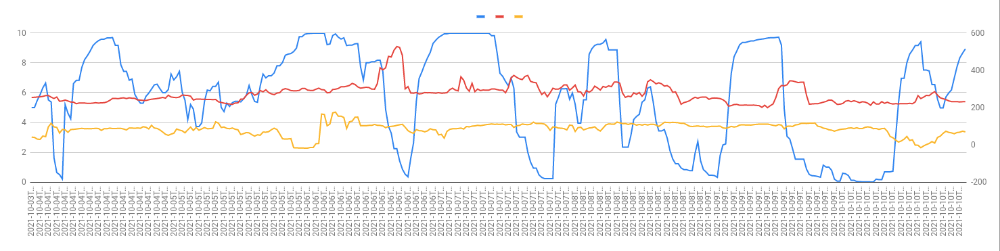
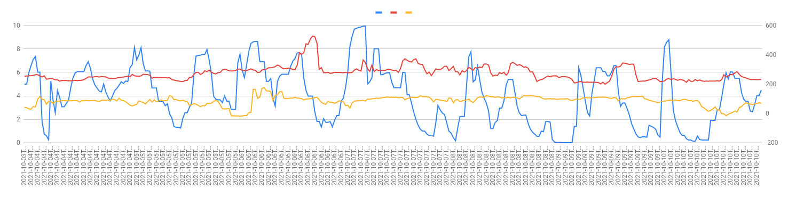

# trading-network

## Requirements

- Node 16 ([nvm](https://github.com/nvm-sh/nvm) is great for this)
- yarn (`npm install yarn -g`)
- Docker (optional)

## Run in docker-compose

```
docker-compose up
```

## Running outside of docker

Install deps

```
yarn
```

Run simulation

```
yarn start
```

The simulation output is written to `services/optimiser/output.log`

**NOTE**: The datetimes written to the log are in ISO UTC, not local time.

## Development

Unit tests are performed by `jest`. They are not extensive and just tests the
APIs function as intended

```
yarn test
```

Linting is done with `xo`

```
yarn xo
```

## Rational

### Trading algorithm

In order to keep things simple and predictable, I used an algorithm which looks at the future prices, up to a given forward planning period,
and decides if the current price is best to sell or buy. It does this by creating a sell and buy factor, based on the battery SOC, the
amount of cycles left for the day, the current price compared to highest and lowest in the foward planning period.

Overall, it works out pretty well, and visualising the output data on graphs shows how the buy and sell prices (yellow and red lines)
relfect the battery SOC when configured with different forward planning periods.

#### 12 hours

<p align="center">
  
</p>

#### 6 hours

<p align="center">
  
</p>

#### 2 hours

<p align="center">
  
</p>

### Language

I chose to use `typescript` as I am very farmiliar with it, and meant I could get the repo setup quickly.
Typescript is a staticly typed language which made development really fast, and javascript is
an asynchronous first language which makes micro-services easily scale with load (and without overhead of threading).

I would be comfortable writing this sort of test in Python, and with a littlebit more time, Go or Rust.

### Workspaces

This repo is built with `yarn workspaces`, a monorepo dependency tool which lets us organise our services
within the monorepo. The advantage of having our services in the same repo would be shared code and type interfaces.
For future development (and given more time), some of the shared boiler plate between services can be extraced and
referenced within the repo (without having to deploy a package to npm)

### Dockerfile

I utilised a shared Dockerfile for all the services (part of the advantage of having a monorepo). The build-args can be used
to provide the context to docker for which service to build.

## Deployment

I've shown how this set of services can easily exist within a cluster with the `docker-compose` model.

In a real world scanario Kubernetes would suit deployment well, as it allows us to use CI/CD to configure the cluster
on repo pushes.

GCP and AWS offer managed K8s clusters (GKE and EKS) which make managing and configuring these clusters something
which can be defined in `terraform` code.

### Deploying only changed services

In the javascript monorepo ecosystem, there is a tool called `lerna` which can be used to track which
services have had code changes since the last deployment. This would mean that even though all our services
exist in the same monorepo, they would not all need to be deployed on every push to `master` (or `main`).

It does this by creating git-tags after deployment, which it then uses as references for determining which
services have changed. If we are using shared code within the repo, lerna can track those shared source dependencies
and if the shared code changes all services which are using the shared code are deployed.

### Databases

As stated [in some of the source code](services/optimiser/src/db/obligations.ts), this sort of work would be ideal
for a relational database model. We know what data we are storing, and don't need to rely on fast write/read access.

AWS and GCP offer managed SQL deployments (Ideally postgres), which I would use for this. They manage sharding and DB high availability
and again can be configured in-code with terraform.

If we were using lots of read/write capacity, AWS's dynamodb is really good for scaling automatically and only charges linearly
based on the number of reads and writes, rather than paying the upfront cost for a managed DB. For this excercise I don't see
using something like dynamodb as rational.

### Cluster architecture

I've made the assumption in this test that the optimiser would be controlling the battery asset, but it may be likely that the
obligations DB is it's own service which consumes market orders and stores them for the battery to retrieve.

In an ideal scenario, something like this would use pub-sub technology (Google Pub-Sub, Amazon SNS) to ensure that all trades
are recorded after submission and are consumed so that trades are not lost (in the event that a DB goes down).

Here's how I think something like this would work

<p align="center">
  
</p>
